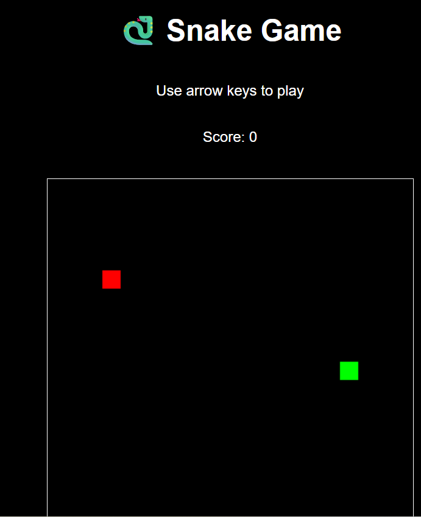

# 🐍 Simple Snake Game

A classic **Snake Game** built with **HTML, CSS, and JavaScript**.  
Move the snake with your arrow keys, eat food to grow, and try to achieve the highest score without colliding with walls or yourself!

---

## 🚀 Features
- 🎮 Playable directly in the browser  
- ⌨️ Controls using **arrow keys**  
- 🍎 Randomly generated food  
- 📈 Score counter updates in real time  
- 💀 Game over detection with restart option  
- 🖥️ Simple, retro-inspired UI  

---

## 📂 Project Structure
snake-game/
│── index.html # Main HTML file with embedded CSS & JavaScript
│── README.md # Project documentation
│── images/
└── demo.png # Screenshot of the game

---

---

## 🛠️ How to Play
1. Open `index.html` in your browser.  
2. Use the **arrow keys** to move the snake:
   - ⬅️ Left  
   - ➡️ Right  
   - ⬆️ Up  
   - ⬇️ Down  
3. Eat the red squares (food) to grow your snake and increase your score.  
4. The game ends if you collide with the walls or yourself.  
5. Press **OK** on the Game Over alert to restart the game.  

---

## 📸 Screenshot

---

## 👨‍💻 Author
**Your Name**  
Made by ❤️❤️ Fawad Alam

---

## 📜 License
This project is open-source and free to use.
